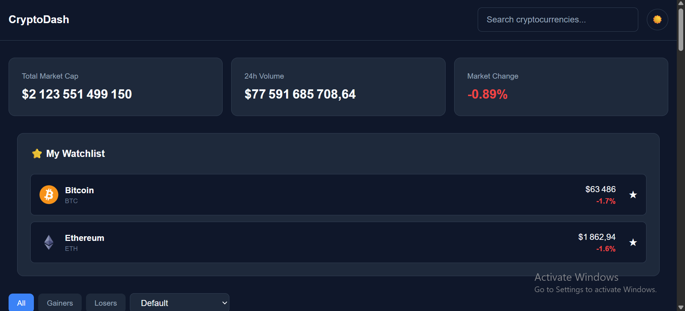
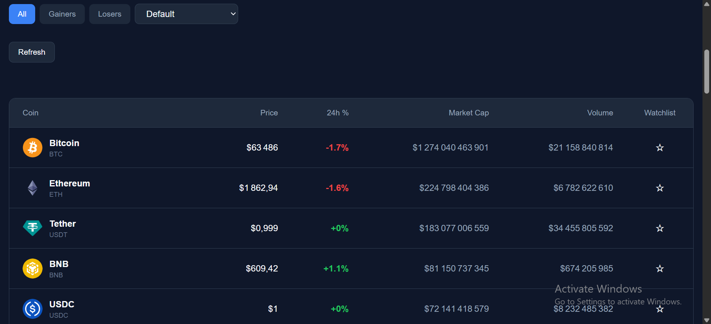
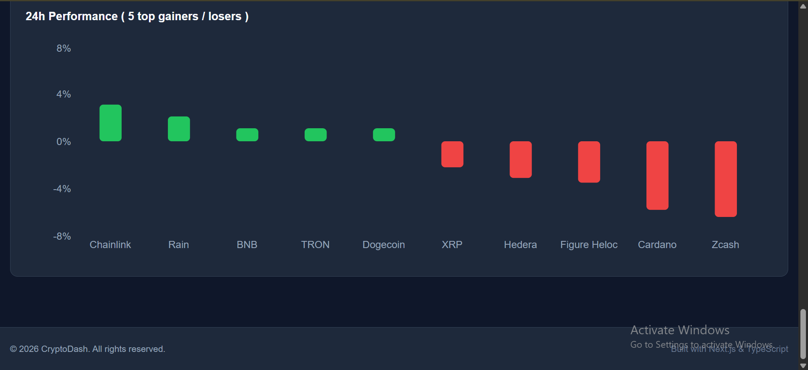
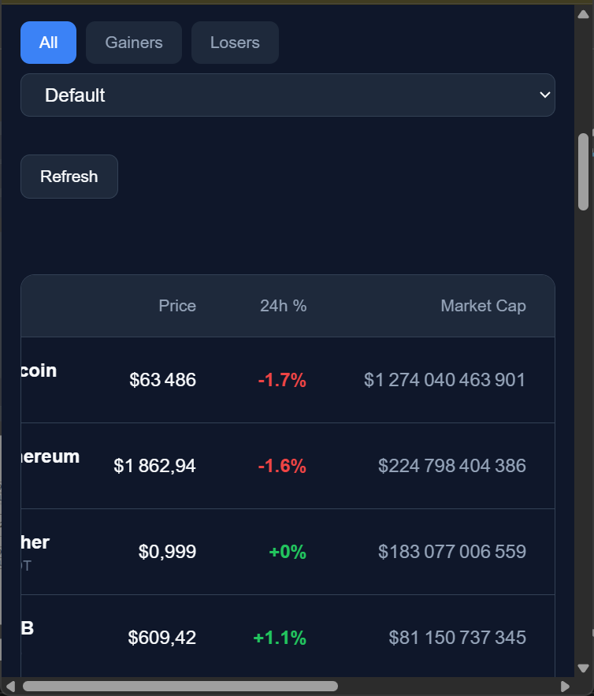

# Crypto Dashboard

A modern and responsive cryptocurrency dashboard built with **Next.js**, **TypeScript**, **Tailwind CSS**, and **Recharts**.

The dashboard allows users to explore cryptocurrency market data, search and filter coins, sort them by different values, view detailed information, manage a personal watchlist, and visualize market data through interactive charts.

## Features

* 📊 Cryptocurrency market overview
* 🔎 Search cryptocurrencies by name or symbol
* 📈 Filter coins by gainers and losers
* ↕️ Sort cryptocurrencies by:
  * Price: Low → High
  * Price: High → Low
  * Name: A → Z
  * Name: Z → A
* 📉 Interactive market charts
* 🪙 Cryptocurrency details pages
* ⭐ Personal watchlist
* 🌓 Dark / Light mode
* 🔄 Refresh cryptocurrency data
* ⏳ Loading states
* ⚠️ Error handling
* 📱 Responsive design
* ♿ Basic accessibility support
* ⚡ Performance optimizations with `useMemo`

## Tech Stack

* **Next.js**
* **React**
* **TypeScript**
* **Tailwind CSS**
* **Recharts**
* **API Fetching**
* **React Context API**

## Project Structure

```text

app/
├── components/
│   ├── CryptoTable.tsx
│   ├── Footer.tsx
│   ├── Header.tsx
│   ├── MarketCapChart.tsx
│   ├── Overview.tsx
│   ├── PerformanceChart.tsx
│   ├── SearchFilter.tsx
│   └── Watchlist.tsx
│
├── crypto/
│   └── [id]/
│       └── page.tsx
│
├── globals.css
├── layout.tsx
└── page.tsx
│
context/
├── ThemeContext.tsx
└── WatchlistContext.tsx
│
lib/
└── api.ts
│
types/
└── crypto.ts
│
screenshohts/
└──

```

## Getting Started

### 1. Clone the repository

```bash

```

### 2. Navigate to the project

```bash
cd crypto-dashboard
```

### 3. Install dependencies

```bash
npm install
```

### 4. Run the development server

```bash
npm run dev
```

Open http://localhost:3000 in your browser.

## Available Scripts

```bash
npm run dev
```

Runs the development server.

```bash
npm run build
```

Creates a production build.

```bash
npm run start
```

Runs the production server.

## Preview









## Responsive Design

The dashboard is designed to work across:

* Desktop
* Tablet
* Mobile

The layout, navigation, search controls, tables, charts, and other UI elements adapt to different screen sizes.

## What I Practiced

This project helped me practice and apply:

* Next.js App Router
* TypeScript types and interfaces
* React state management
* React Context API
* API data fetching
* Search and filtering
* Sorting
* Dynamic routes
* Data visualization
* Responsive UI development
* Dark / Light themes
* Accessibility
* Performance optimization
* Component-based architecture
* Advanced Tailwind CSS practices

## Project Status

The project is complete and ready for deployment.

## Author

**Haroun Draoui**

Frontend Developer

- LinkedIn: [LinkedIn](https://www.linkedin.com/in/draoui-haroun-1b0200413/)
- GitHub: [GitHub](https://github.com/Draoui-Haroun)
- Portfolio: [Portfolio](https://portfolio-omega-beige-50.vercel.app/)
